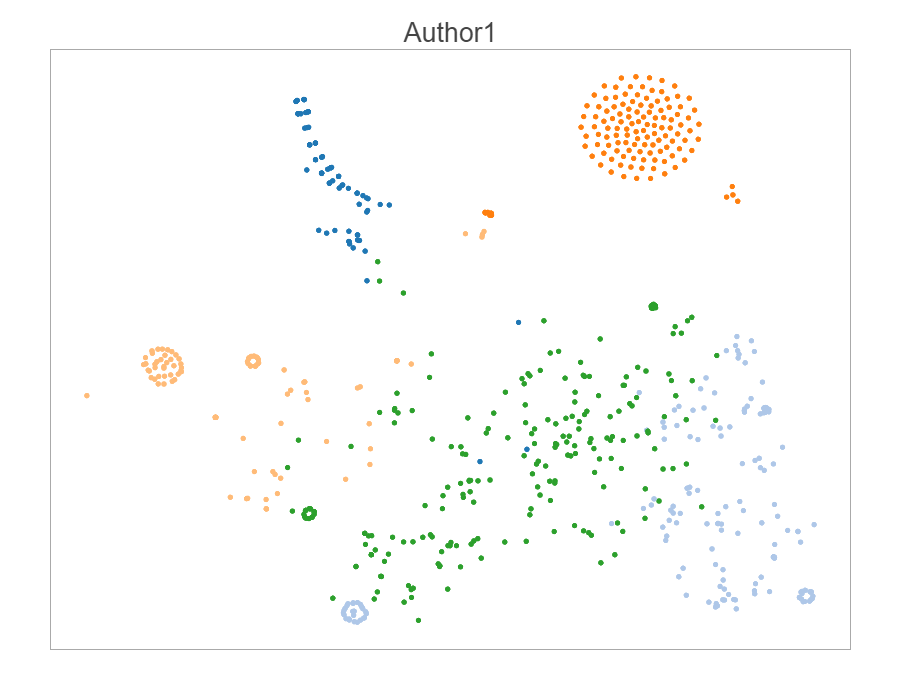
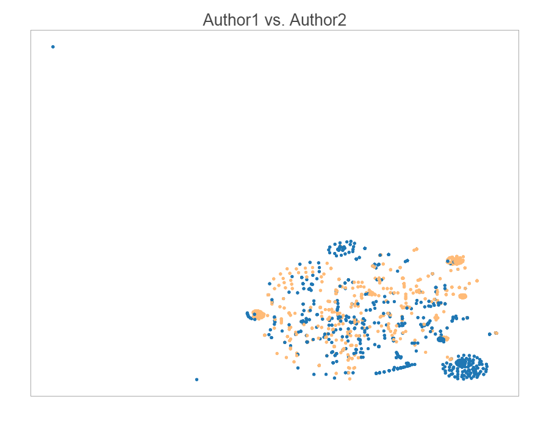

原文：[News Headline Analysis](http://nbviewer.jupyter.org/github/AYLIEN/headline_analysis/blob/06f1223012d285412a650c201a19a1c95859dca1/main-chunks.ipynb)

---

在这个项目中，我们分析两个记者写的新闻标题 —— 一个是来自于Business Inside的**财政**记者，一个是来自于Huffington post的**名人**记者 —— 来寻找这两个记者为他们的新闻文章和博客编写标题之间的异同。我们选定的记者是：

  * 来自Business Insider的Akin Oyedele，报道市场更新；以及
  * 来自Huffington Post的Carly Ledbetter，主要报道关于名人的新闻。

### 方法

我们一开始会收集和分析每个作者的新闻标题，来获得一个解析树，然后，我们会从这些表示标题的整体结构的解析树中抽取某些信息。

接下来，我们将定义一个简单的序列相似性指标来定量比较任何一对新闻标题，然后我们会将相同的方法应用到已经收集到的每个作者的所有标题上，来找出每对标题有多相似。

最后，我们将使用K-均值和tSNE来生成所有标题的直观图，这样，我们就能更加清晰的看到这两位作者之间的异同。

### 数据

For this project we've gathered 700 headlines for each author using the
对于该项目，我们已经使用[AYLIEN News API](https://newsapi.aylien.com)收集了每个作者700个标题，我们打算用Python来进行分析。你可以直接从GitHub仓库中获得Pickled数据文件，或者使用我们为这个项目准备的[数据收集notebook](http://nbviewer.jupyter.org/github/AYLIEN/headline_analysis/blob/6f1223012d285412a650c201a19a1c95859dca1/XXX)。

### 解析树初识

在语言学中，一颗解析树是一颗有根树，根据一些预先定义的语法，表示句子的句法结构。

对于一个简单的句子，例如，"The cat sat on the mat"，一颗解析树可能看起来像这样：


我们将使用Python中的[Pattern库](http://www.clips.ua.ac.be/pages/pattern-en#tree)，来解析标题，并为它们创建解析树：

In [36]:
    
```python    
    from pattern.en import parsetree
```    

让我们来看看一个例子：

In [37]:

```python    
s = parsetree('The cat sat on the mat.')
for sentence in s:
    for chunk in sentence.chunks:
        print chunk.type, [(w.string, w.type) for w in chunk.words]
```    
        
    NP [(u'The', u'DT'), (u'cat', u'NN')]
    VP [(u'sat', u'VBD')]
    PP [(u'on', u'IN')]
    NP [(u'the', u'DT'), (u'mat', u'NN')]
    

### 加载数据

让我们为第一个作者(Akin Oyedele)加载Pickled数据文件，该文件包含700个标题，然后来看个例子，看看一个标题可能看起来是怎么样的：

In [66]:
    
```python    
    import cPickle as pickle
    author1 = pickle.load( open( "author1.p", "rb" ) )
    author1[0]
```    

Out[66]:
    
    {u'title': u"One corner of the real-estate market might've peaked"}

### 解析数据

现在，我们加载了第一个作者的所有标题，我们将分析它们，为每个标题创建解析树，然后将它们以及一些关于对应标题的基本信息存储在相同的对象中：

In [67]:

```python    
    for story in author1:
        story["title_length"] = len(story["title"])
        story["title_chunks"] = [chunk.type for chunk in parsetree(story["title"])[0].chunks]
        story["title_chunks_length"] = len(story["title_chunks"])
```    

In [40]:

```python    
    author1[0]
```    

Out[40]:

    {u'title': u"One corner of the real-estate market might've peaked",
     'title_chunks': [u'NP', u'PP', u'NP', u'VP'],
     'title_chunks_length': 4,
     'title_length': 52}

让我们看看这个作者编写的题目的数值属性是什么样子的。我们将使用[Pandas](http://pandas.pydata.org/)。

In [41]:

```python    
    import pandas as pd
    
    df1 = pd.DataFrame.from_dict(author1)
```    

In [42]:

```python    
    df1.describe()
```    

Out[42]:

| title_chunks_length | title_length  
---|---|---  
count | 700.000000 | 700.000000  
mean | 5.691429 | 57.730000  
std | 3.762884 | 28.035283  
min | 1.000000 | 9.000000  
25% | 2.000000 | 35.000000  
50% | 5.000000 | 53.000000  
75% | 7.000000 | 77.000000  
max | 30.000000 | 188.000000  
  

从这个信息中，我们将提取每个题目的块型序列（例如，该解析树的第一层），并将其作为标题的整体结构的一个指标来使用。因此，在上面的例子中，我们将在我们的分析中提取并使用下面的块类型顺序：
    
    
    ['NP', 'PP', 'NP', 'VP']

### 相似性

我们已经加载了第一个作者编写的所有标题，创建并保存了它们的解析树。接下来，我们需要找到给定两个块类型序列的相似性矩阵，来看看从结构的角度来看，这两个标题直接有多相似。

为此，我们将使用difflib的SequenceMatcher类，它为任何两个序列（Python列表）生成一个介于0和1直接的相似性得分：

In [65]:

```python    
    import difflib
    print "Similarity scores for...\n"
    print "Two identical sequences: ", difflib.SequenceMatcher(None,["A","B","C"],["A","B","C"]).ratio()
    print "Two similar sequences: ", difflib.SequenceMatcher(None,["A","B","C"],["A","B","D"]).ratio()
    print "Two completely different sequences: ", difflib.SequenceMatcher(None,["A","B","C"],["X","Y","Z"]).ratio()
```    
    
    
    Similarity scores for...
    
    Two identical sequences:  1.0
    Two similar sequences:  0.666666666667
    Two completely different sequences:  0.0
    
现在，让我们来看看如何与我们的块类型序列一起工作，对于两个来自第一个作者的随机选择的标题：

In [68]:

```python    
    v1 = author1[3]["title_chunks"]
    v2 = author1[1]["title_chunks"]
    
    print v1, v2, difflib.SequenceMatcher(None,v1,v2).ratio()
```    
    
    
    [u'NP', u'NP', u'VP', u'NP', u'NP', u'VP', u'PP'] [u'NP', u'VP', u'NP', u'PP', u'NP', u'NP'] 0.615384615385
    

### 标题的成对相似矩阵

现在，我们将应用相同的序列相似性矩阵到所有的标题上，并创建一个标题直接的成对相似分数的700x700矩阵：

In [44]:

```python    
    import numpy as np
    chunks = [author["title_chunks"] for author in author1]
    m = np.zeros((700,700))
    for i, chunkx in enumerate(chunks):
        for j, chunky in enumerate(chunks):
            m[i][j] = difflib.SequenceMatcher(None,chunkx,chunky).ratio()
```    

### 可视化

为了更清晰，更易于理解，让我们试着将第一个作者写的所有的标题放到一个2D散点图上，在上面，相似结构的标题会聚合在一起。

对此，我们将首先使用tSNE来将我们的相似性矩阵从700降维到2：

In [45]:

```python    
    from sklearn.manifold import TSNE
    tsne_model = TSNE(n_components=2, verbose=1, random_state=0)
```    

In [46]:

```python    
    tsne = tsne_model.fit_transform(m)
```    
       
    [t-SNE] Computing pairwise distances...
    [t-SNE] Computed conditional probabilities for sample 700 / 700
    [t-SNE] Mean sigma: 0.000000
    [t-SNE] Error after 83 iterations with early exaggeration: 13.379313
    [t-SNE] Error after 144 iterations: 0.633875
    

为了我们的可视化生动些，让我们用K-Means找出相似标题的5个集群，我们将在我们的可视化中使用：

In [47]:

```python    
    from sklearn.cluster import MiniBatchKMeans
    
    kmeans_model = MiniBatchKMeans(n_clusters=5, init='k-means++', n_init=1, 
                             init_size=1000, batch_size=1000, verbose=False, max_iter=1000)
    kmeans = kmeans_model.fit(m)
    kmeans_clusters = kmeans.predict(m)
    kmeans_distances = kmeans.transform(m)
```    

最后，让我们使用[Bokeh](http://bokeh.pydata.org/en/latest/)绘制实际图表：

In [48]:

```python    
    import bokeh.plotting as bp
    from bokeh.models import HoverTool, BoxSelectTool
    from bokeh.plotting import figure, show, output_notebook
    
    colormap = np.array([
        "#1f77b4", "#aec7e8", "#ff7f0e", "#ffbb78", "#2ca02c", 
        "#98df8a", "#d62728", "#ff9896", "#9467bd", "#c5b0d5", 
        "#8c564b", "#c49c94", "#e377c2", "#f7b6d2", "#7f7f7f", 
        "#c7c7c7", "#bcbd22", "#dbdb8d", "#17becf", "#9edae5"
    ])
    
    output_notebook()
    plot_author1 = bp.figure(plot_width=900, plot_height=700, title="Author1",
        tools="pan,wheel_zoom,box_zoom,reset,hover,previewsave",
        x_axis_type=None, y_axis_type=None, min_border=1)
    
    plot_author1.scatter(x=tsne[:,0], y=tsne[:,1],
                        color=colormap[kmeans_clusters],
                        source=bp.ColumnDataSource({
                            "chunks": [x["title_chunks"] for x in author1], 
                            "title": [x["title"] for x in author1],
                            "cluster": kmeans_clusters
                        }))
    
    hover = plot_author1.select(dict(type=HoverTool))
    hover.tooltips={"chunks": "@chunks (title: \"@title\")", "cluster": "@cluster"}
    show(plot_author1)
```    

(Ele注：这个图原效果放不上来，只能放一张图了，强烈建议到原文看看)



Out[48]:

`<Bokeh Notebook handle for **In[6]**>`

上面的交互式图标显示了标题的一些密集组，以及一些稀疏组。一些更加明显的密集组是：

  * 左边的**NP, VP**组，通常由简单，活泼的股票更新标题，例如"Viacom is crashing"组成；
  * 右上角的**VP, NP**组，它们大部分以"Here comes the..."这种格式宣布标题；以及
  * 左下方的**NP, VP, ADJP, PP, VP**组，其中，我们有例如"Industrial production **falls more than expected**"或者"ADP private payrolls **rise more than expected**"这样 标题

如果你仔细观察，你会发现其他有趣的组，以及当与它们的邻居相比较时它们的异同之处。

### 比较两个作者

最后，让我们加载第二个作者的标题，看看与第一个相比，是怎样的。步骤与前面非常相似，但这次我们将计算两组标题的相似性，然后将其存储在一个1400x1400的矩阵中：

In [49]:

```python    
    author2 = pickle.load( open( "author2.p", "rb" ) )
    for story in author2:
        story["title_length"] = len(story["title"])
        story["title_chunks"] = [chunk.type for chunk in parsetree(story["title"])[0].chunks]
        story["title_chunks_length"] = len(story["title_chunks"])
```   

In [50]:

```python    
    pd.DataFrame.from_dict(author2).describe()
```    

Out[50]:

| title_chunks_length | title_length  
---|---|---  
count | 700.000000 | 700.000000  
mean | 5.452857 | 62.532857  
std | 1.896252 | 9.996154  
min | 1.000000 | 35.000000  
25% | 4.000000 | 57.000000  
50% | 5.000000 | 62.000000  
75% | 7.000000 | 68.000000  
max | 13.000000 | 96.000000  
  
基础数据并不能显示出这两个作者写的标题的显著差异。

In [51]:

```python    
    chunks_joint = [author["title_chunks"] for author in (author1+author2)]
    m_joint = np.zeros((1400,1400))
    for i, chunkx in enumerate(chunks_joint):
        for j, chunky in enumerate(chunks_joint):
            sm=difflib.SequenceMatcher(None,chunkx,chunky)
            m_joint[i][j] = sm.ratio()
```    

显著，我们分析了第二个作者的标题，让我们看卡这两个作者之间存在多少共同的模式：

In [52]:

```python    
    set1= [author["title_chunks"] for author in author1]
    set2= [author["title_chunks"] for author in author2]
    list_new = [itm for itm in set1 if itm in set2]
    len(list_new)
```    

Out[52]:
    
    347

我们观察到有大约50% (347/700)的标题具有相同的结构。

### 两个作者的标题可视化

我们这里的方法与我们对第一个作者所做的颇为相似。这里唯一的不同在于，这次，我们将使用颜色来表示_作者_，而不是集群（作者1是蓝色，作者2是橙色）。

In [53]:

```python    
    tsne_joint = tsne_model.fit_transform(m_joint)
```    
    
    
    [t-SNE] Computing pairwise distances...
    [t-SNE] Computed conditional probabilities for sample 1000 / 1400
    [t-SNE] Computed conditional probabilities for sample 1400 / 1400
    [t-SNE] Mean sigma: 0.000000
    [t-SNE] Error after 83 iterations with early exaggeration: 16.425770
    [t-SNE] Error after 148 iterations: 0.942156
    

In [54]:

```python    
    plot_joint = bp.figure(plot_width=900, plot_height=700, title="Author1 vs. Author2",
        tools="pan,wheel_zoom,box_zoom,reset,hover,previewsave",
        x_axis_type=None, y_axis_type=None, min_border=1)
    
    plot_joint.scatter(x=tsne_joint[:,0], y=tsne_joint[:,1],
                        color=colormap[([0] * 700 + [3] * 700)],
                        source=bp.ColumnDataSource({
                            "chunks": [x["title_chunks"] for x in author1] + [x["title_chunks"] for x in author2], 
                            "title": [x["title"] for x in author1] + [x["title"] for x in author2]
                        }))
    
    hover = plot_joint.select(dict(type=HoverTool))
    hover.tooltips={"chunks": "@chunks (title: \"@title\")"}
    show(plot_joint)
```    



Out[54]:

`<Bokeh Notebook handle for **In[6]**>`

这里，我们观察到了相同的密集和稀疏模式，以及对每个作者有些独特，或者由两个作者共享的点的组。

  * 右下角的集群几乎是第一个作者独有的，因为它覆盖了简短的金融/股票报道标题，例如，"Here comes CPI"，但它也覆盖了一些来自第一个作者的其他标题，例如，"There's Another Leonardo DiCaprio Doppelgänger"。顶部中间的集群也是一样的。
  * 右上方的集群大部分包含有关名人做事的单动词标题，例如，"Kylie Jenner Graces Coachella With Her Peachy Presence"或者"Kate Hudson Celebrated Her Birthday With A Few Shirtless Men"，但它也包含来自第一个作者的市场报道，例如"Oil rig count plunges for 7th straight week"。

我们相信，你可以通过自己观察上面的图表来发现更多有趣的东西。

### 总结以及未来的工作

在这个项目中，我们已经展示了可以如何检索和分析新闻标题，评估它们的结构和相似性，并构建一个交互式地图来清晰的看到它们。

我们的方法的一些缺点，以及改善它们的方法：

  * 使用整个解析树，而不只是块类型
  * 使用一个树或者图相似性矩阵，而不是一个序列相似性矩阵（理想的是一个语言感知相似性矩阵）
  * 最好预处理，以确定和规范命名实体，等等。

在以后的文章中，我们将要研究各种标题结构和一些外部矩阵，例如社交媒体平台上的分享数和点赞数，之间的相关性，来看看我们是否能发现一些好玩的模式。